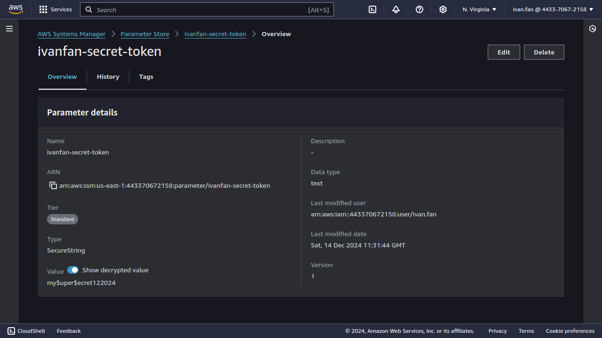
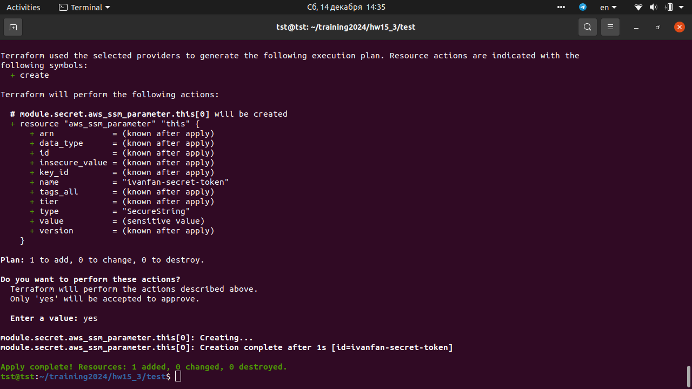
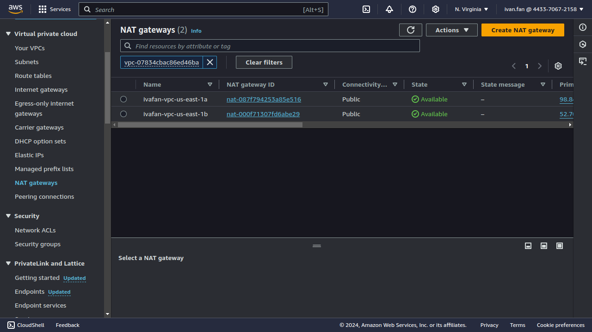
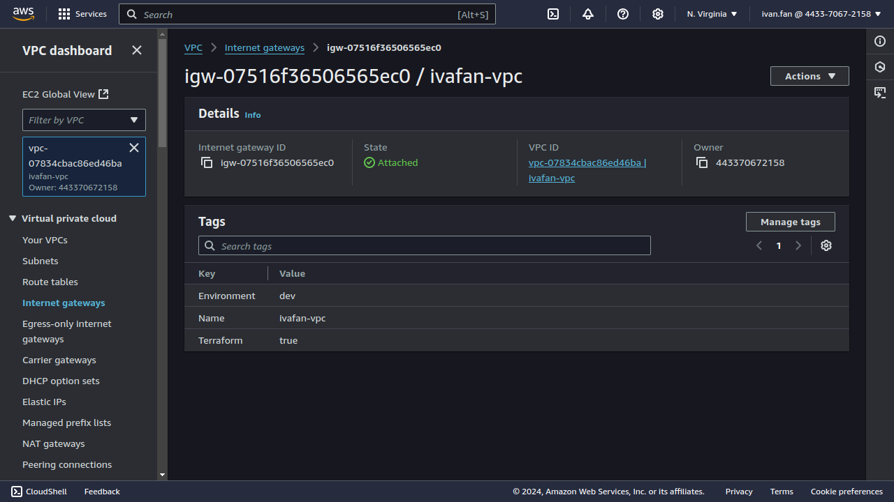
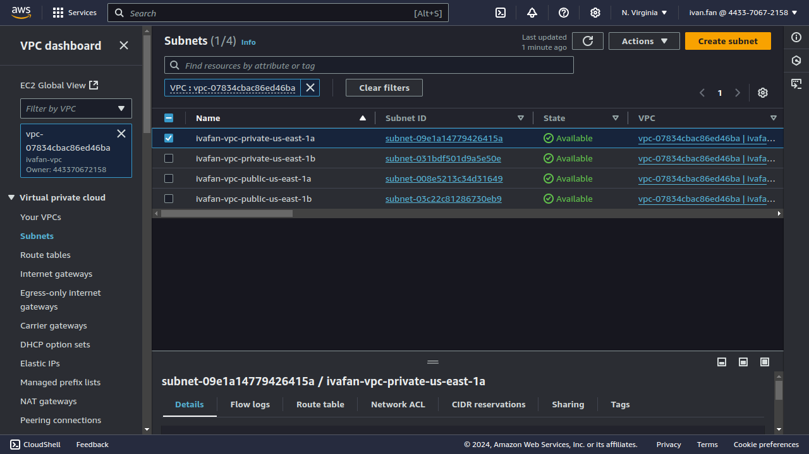
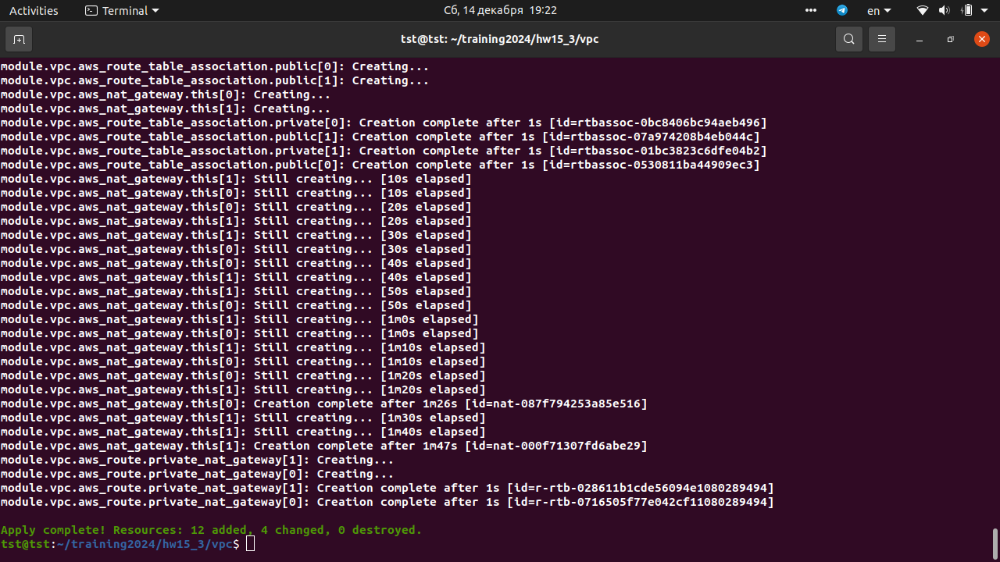

# IBA devops training

## HW15. Terraform. Creating ssm-parameter and vpc with external modules

#### Creating secret with external module terraform-aws-modules/ssm-parameter/aws

[main.tf](https://github.com/voyager1122/iba_hw15/blob/main/ssm-parameter/main.tf)

## Create VPC with external module  terraform-aws-modules/vpc/aws

[main.tf](https://github.com/voyager1122/iba_hw15/blob/main/vpc/main.tf)

